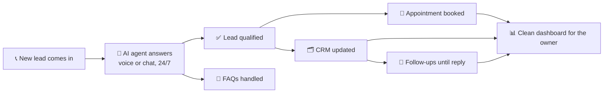

<div align="center">


<a href="https://github.com/YukiCordero">
  
</a>

<br/>

<a href="https://yukicordero.github.io/Portfolio/"></a>
<a href="https://www.linkedin.com/in/yuki-cordero/"></a>
<a href="mailto:hello.yukicordero@gmail.com"></a>


</div>

## 🧠 About Me

```console
yuki@automation-hq:~$ whoami
Yuki Cordero — AI Automation Specialist & Tech VA · Davao City, PH 🇵🇭

yuki@automation-hq:~$ cat mission.txt
I build systems that answer leads in seconds, follow up forever,
and keep CRMs clean — so business owners can escape their inbox.

yuki@automation-hq:~$ ls ~/builds
ai-front-desk/  appointment-setter/  coffee-pos/  rag-chatbot/  job-finder/

yuki@automation-hq:~$ uptime
 24/7 — my agents don't sleep, so my clients can

yuki@automation-hq:~$ alias
alias twice='turn-it-into-a-workflow'

yuki@automation-hq:~$ history | tail -3
  001  overengineer something simple
  002  automate the overengineered thing
  003  repeat

yuki@automation-hq:~$ exit
logout — don't worry, the automations keep running
```

## ⚙️ Tech Stack

<div align="center">

**Languages & Frameworks**


**Automation & AI**


</div>

## 🚀 Featured Builds

| Project | What it does | Built with |
|---------|-------------|------------|
| 🏢 [**AI Front Desk**](https://github.com/YukiCordero/ai-front-desk-n8n) | Multi-tenant AI front desk + follow-up automation for service businesses — sanitized workflow exports with full setup & troubleshooting docs | `n8n` `OpenAI` `Airtable` |
| 🧹 [**AI Appointment Setter**](https://github.com/YukiCordero/ai-appointment-setter-cleaning-business) | Lead follow-up, CRM updates, and calendar booking on autopilot for a cleaning business | `n8n` `AI` `Calendar API` |
| ☕ [**Dream Coffee POS**](https://github.com/YukiCordero/dream-coffee-pos-firebase) | Full POS dashboard — ordering, inventory, sales reports, employee time logs, and payroll | `React` `Firebase` `JavaScript` |
| 🤖 [**RAG Chatbot Backend**](https://github.com/YukiCordero/rag-chatbot-backend) | Retrieval-augmented chatbot backend for grounded, document-aware answers | `Python` `RAG` `LLM` |
| 🌐 [**Portfolio**](https://yukicordero.github.io/Portfolio/) | This is where the case studies live — results, process, and rates | `HTML` `CSS` `JS` |

## 🔁 Anatomy of My Builds

Every automation I ship follows the same promise: **the lead never waits, and the owner never types.**



## 📊 GitHub Stats

<div align="center">


</div>

## 🎮 Contributions, But Make Them Fun

My commit history as a neon city — every building is a day of shipping:

<div align="center">

<picture>
  <source media="(prefers-color-scheme: dark)" srcset="https://raw.githubusercontent.com/YukiCordero/YukiCordero/output/profile-night-rainbow.svg" />
  <source media="(prefers-color-scheme: light)" srcset="https://raw.githubusercontent.com/YukiCordero/YukiCordero/output/profile-season-animate.svg" />
  
</picture>

And a snake eating its way through the year:

<picture>
  <source media="(prefers-color-scheme: dark)" srcset="https://raw.githubusercontent.com/YukiCordero/YukiCordero/output/github-snake-dark.svg" />
  <source media="(prefers-color-scheme: light)" srcset="https://raw.githubusercontent.com/YukiCordero/YukiCordero/output/github-snake.svg" />
  
</picture>

</div>

---

<div align="center">


*"If I have to do it twice, it becomes a workflow."*


</div>
